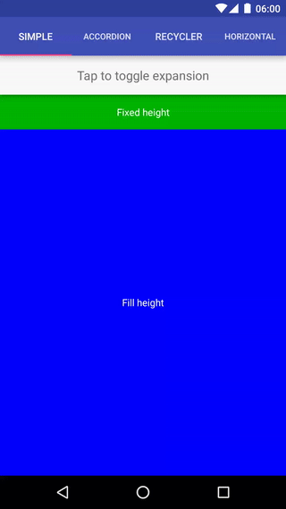
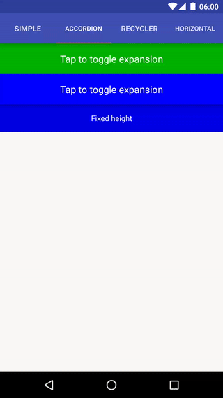
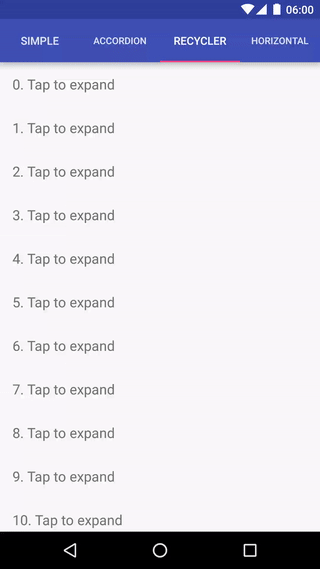
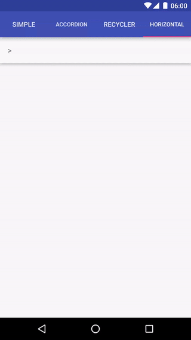

# ExpandableLayout

An Android layout class that supports animating the expansion and collapse of its child views.

I built this because all of the available libraries I tested were missing features or behaving unexpectedly in certain cases (e.g. rotation handling).

This library offloads as much work as possible to the parent layout to ensure that the rendering and size calculations behave as expected. This means that even complex features such as LinearLayout's `weight` tag are properly supported.

Currently the only implemented expandable layout is based on the framework's LinearLayout since it supports all of the requirements for my current use cases. If the need for other variants arises, it should be easy to adapt the current solution to a FrameLayout, RelativeLayout or others.

## Note to current users

I've decided to redesign how the expansion animation works. Instead of gradualy increasing the size of the child views, they now remain the same size and are instead "pushed" in or out of view. The new method:

* Is more efficient since the child view doesn't run a layout pass in each frame
* Looks better since the items inside the the child view don't adjust during the animation
* Contains a lot less code, and therefore less chances to break
* Has a simpler API

The new implementation is contained in the `ExpandableLayout` class. Since the API is slightly different, I've kept the old implementation in the `ExpandableLinearLayout` class. If you're already using older versions of this library, you don't have to change anything.

In any case I recommend you look at the new class. A demo of the new API is shown in the `demo` module included with this project. The old API is demonstrated in the `legacy_demo` module.

## Features

ExpandableLayout supports animating:

* Views with fixed and variable heights:



* "Accordion" expansion (using two expandable layouts)



* RecyclerView items



* Horizontal expansion



## Usage

Reference the library from your module's build.gradle:

``` gradle
dependencies {
    [...]
    compile 'net.cachapa.expandablelayout:expandablelayout:[latest_version]'
}
```

Latest version: [  ](https://bintray.com/cachapa/maven/expandablelayout/_latestVersion)

Add `ExpandableLayout` as a container to the layout or views you want to make expandable:

``` xml
<net.cachapa.expandablelayout.ExpandableLayout
    android:id="@+id/expandable_layout"
    android:layout_width="match_parent"
    android:layout_height="wrap_content"
    app:el_duration="1000"
    app:el_expanded="true"
    app:el_translate_children="true">

    <TextView
        android:layout_width="match_parent"
        android:layout_height="wrap_content"
        android:padding="16dp"
        android:text="Fixed height" />

</net.cachapa.expandablelayout.ExpandableLayout>
```
Also supported are `el_duration` and `el_expanded` tags, for specifying the duration of the animation and whether the layout should start expanded, respectively. The `el_translate_children` flag determines if the child view should be translated during expansion.

To trigger the animation, simply grab a reference to the ExpandableLayout from your Java code and and call either of `expand()`, `collapse()` or `toggle()`.

A full demo of the library is included with the project.

## License

    Copyright 2016 Daniel Cachapa.

    Licensed under the Apache License, Version 2.0 (the "License");
    you may not use this file except in compliance with the License.
    You may obtain a copy of the License at

       http://www.apache.org/licenses/LICENSE-2.0

    Unless required by applicable law or agreed to in writing, software
    distributed under the License is distributed on an "AS IS" BASIS,
    WITHOUT WARRANTIES OR CONDITIONS OF ANY KIND, either express or implied.
    See the License for the specific language governing permissions and
    limitations under the License.

## Footnotes

Gifs were generated using the following script: https://gist.github.com/cachapa/aa829bfc717fc4f1d52c568d7ae8521e
